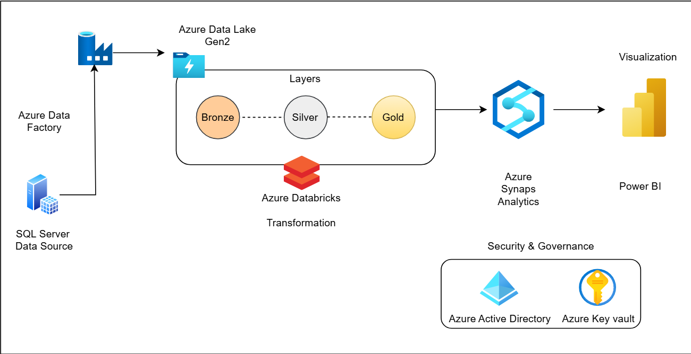
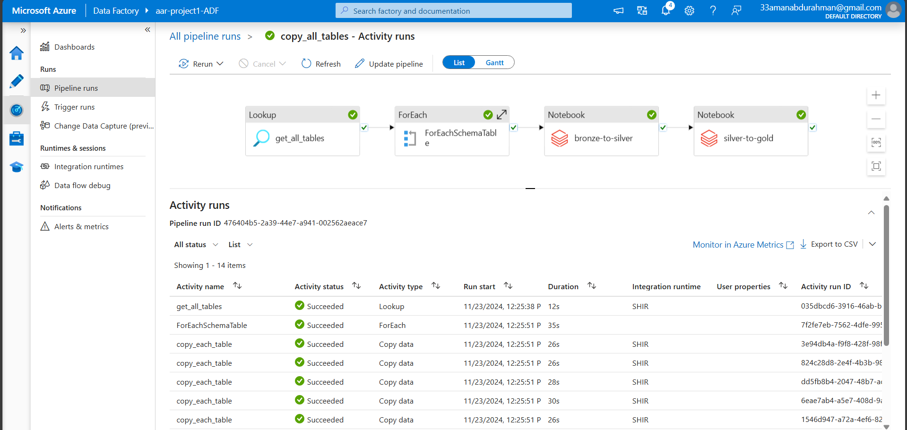
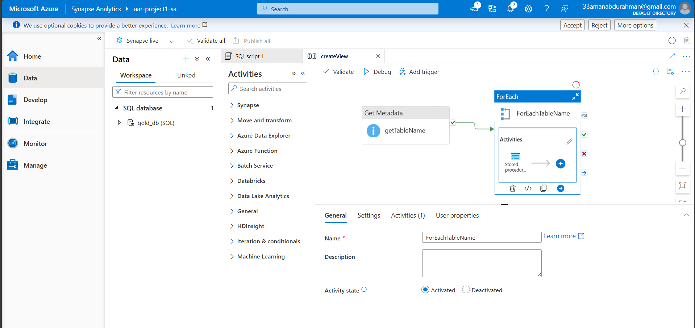
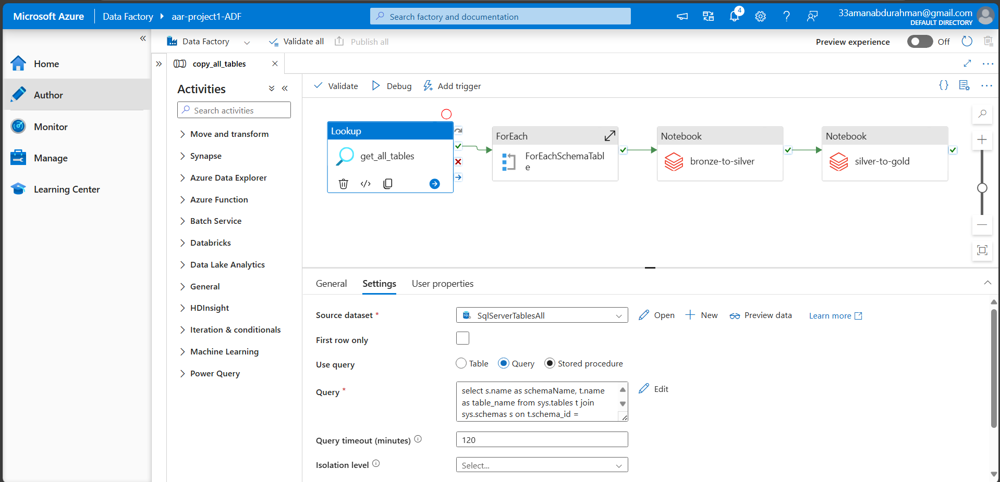
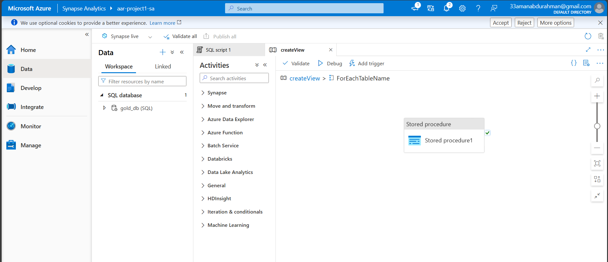

# Olympics Data engineering and analysis project

## Overview

In this Data Engineering Project, we have a data set in on-premise SQL Server database AdventureWorkDB and it will cover a common use case involving the migration of this on-premise database data to the cloud, using tools like Azure Data Factory, Azure Data Lake, and Azure Databricks to perform data ingestion, transformation and Analysis respectively. main goal of the project is that to get clear understanding of how to leverage different Azure resources to build a data engineering project

## Prerequisites

Directions or anything needed before running the project.

- Azure Account
- Good to have basic understanding about Azure Services
- Basic Knowledge on SQL and Python/PySpark, Power BI

## How to Run This Project

Tools/Services Used: SQL Server, Azure Data Factory, Azure Synapse Analytics, Databricks, Azure KeyVault, Azure Active Directory, Power BI

Since this Project is compeletly cloud based, we don't need to any Program/Software to install in local system, in this project i have data source from SQL Server database and we are perfroming all extraction, transformation, loading, analytics are done mostly using cloud (Azure)

### Data Architecture

As per above Architecture, we have data source placed on premise SQL Server database, from there we make use Azure Data factory to get the data into Azure and copy into Azure Data lake storage, where same raw data first ingested into a bronze layer, then transformed into a silver layer, and then finally converted into a gold layer using Azure Databricks. Once the data is fully transformed and organized, it will be loaded into Azure Synapse Analytics, mirroring the original SQL database structure, using Synapse Analytics we can perform some analytics using SQL queries,and we can create dashboards in Visualization tools like Power BI.

### End-to-End Data Pipeline

### Data Visualization

## Lessons Learned

It's good to reflect on what you learned throughout the process of building this project. Here you might discuss what you would have done differently if you had more time/money/data. Did you end up choosing the right tools or would you try something else next time?

## Contact

Please feel free to contact me if you have any questions at: LinkedIn, Twitter
