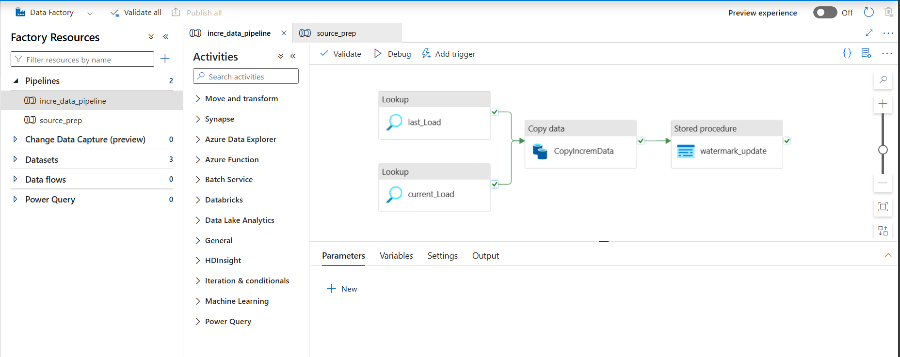
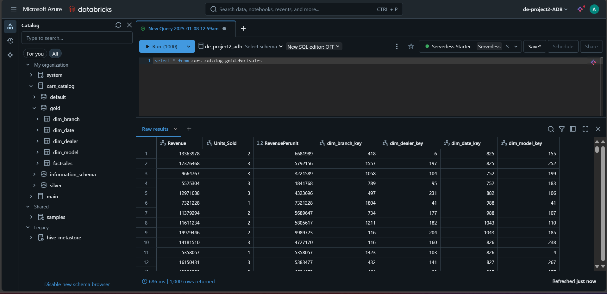

# Azure Data Engineering Project

## Overview

In this End-to-End Data Engineering Project, we have a data set of Car Sales data as Data source, which is loaded in github repository and we then ingesst the data into SQL database with help of ETL pipeline in data factory. We will perform data transformation using databricks and this is achieved by following Medallion architecture to process and analyze car sales data. this project focuses on incremental data loading, SCD Type-1, star schema design to transform data to analytical-ready insights.

## Prerequisites

- Basic Knowledge on SQL and Python/PySpark
- Azure Account
- Good to have basic understanding about Azure Services (ADF, databricks, data lake)

## Tools/Technologies Used

1. Azure SQL Database -> Storing raw data from Github source
2. Azure Data Factory -> Builting ETL pipelines
3. Azure Databricks -> Data transformation
4. Azure Data lake gen2 -> data storage and for transformation layers (Bronzr, Silver and Gold) 

### Data Architecture

As per above Architecture, we have data source placed in Github repostiry, from there we ingest data into data alke storage using Azure Data factory by creating pipleines here we loading data as raw data, then we use Azure databricks to do soe basic transformation and clean the data. then we load transformed data/cleansed data to azure data lake storage. then we use Azure synapse analytics to get the clean data and perform some analytics using SQL queries, so we can create dashboards in Data analysis tools like Power BI or Tableau

### End-to-End Data Pipeline

### Data Visualization

## Lessons Learned

It's good to reflect on what you learned throughout the process of building this project. Here you might discuss what you would have done differently if you had more time/money/data. Did you end up choosing the right tools or would you try something else next time?

## Contact

Please feel free to contact me if you have any questions at: LinkedIn, Twitter
