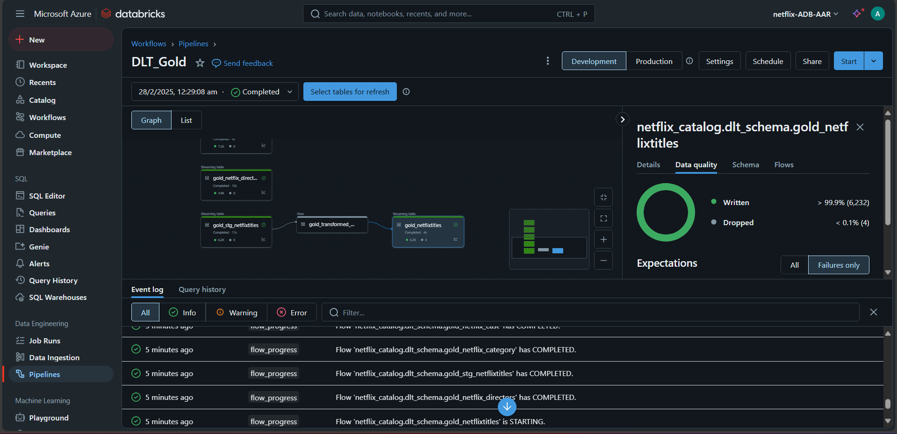

# Azure Data Engineering Project - Netflix Dataset

## Overview

In this Data Engineering Project, I have developed end-to-end ETL pipeline which dynamicaly ingest multiple Netflix raw data from GitHub using API into landing zone in ADLS and we use Databricks Autloader to implement incremental loading as well. I have used databricks for data cleaning, aggregating into structured data, leveraging the Medallion Architecture and Delta Lake. Implemented Delta Live tables, DLT pipelines for final transformations which then carried out to Serving layer

## Prerequisites

Directions or anything needed before running the project.

- Basic Knowledge on and Python/PySpark and SQL
- Azure Account
- Good to have basic understanding about Azure Data Services

## Technologies Used

✅ Azure Data Factory (ADF) – Seamless data orchestration  
✅ Databricks – Data Processing Tool  
✅ Unity Catalog – Secure and scalable data governance  
✅ Delta Live Tables (DLT) – Automated pipeline magic  
✅ Apache Spark – for Data transformation, Aggregations  
✅ Delta Lake – Reliable and fast data lakehouse  
✅ Azure Data Lake – Scalable cloud storage  

### Data Architecture

As per the architecture, the data source is stored in a GitHub repository. From there, we ingest the data into Data Lake Storage using Azure Data Factory by creating parameterized pipelines and establishing incremental data loading with Databricks Autoloader. In Data Lake Storage, we have implemented the Medallion Architecture, where the initial raw data is placed in the Bronze layer. The data is then transformed using Azure Databricks at various stages. The transformed data is subsequently loaded into the Silver layer, and the final transformation is loaded into the Gold layer, which serves as the Serving layer.

During the final transformation from Silver to Gold, I have implemented Delta Live Tables (DLT) and utilized DLT pipelines. DLT facilitates the final transformations based on our requirements, and the results are written to the Serving layer (Gold layer).

### End-to-End Data Pipeline

## Lessons Learned

It's good to reflect on what you learned throughout the process of building this project. Here you might discuss what you would have done differently if you had more time/money/data. Did you end up choosing the right tools or would you try something else next time?

