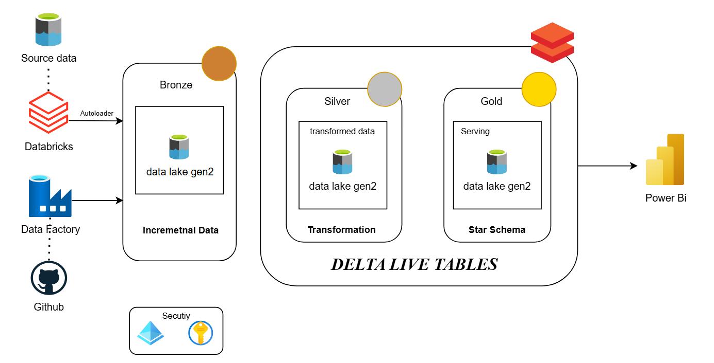

# Azure Data Engineering Project - Netflix Dataset

## Overview

In this Data Engineering Project, i have developed end-to-end ETL pipeline that transforms Netflix data from raw formats into high-quality, structured data, ready for advanced analytics, leveraging the Medallion Architecture and Delta Lake. I have also implemented increamental data loading in databricks using Autoloader.

## Prerequisites

Directions or anything needed before running the project.

- Basic Knowledge on and Python/PySpark and SQL
- Azure Account
- Good to have basic understanding about Azure Data Services

## How to Run This Project

Since this Project is compeletly cloud based, we don't need to any Program/Software to install in local system

1. Place the data source in Github repositoy 
2. Setup Azure account (Free trial with credits)

### Data Architecture

As per the architecture, the data source is stored in a GitHub repository. From there, we ingest the data into Data Lake Storage using Azure Data Factory by creating parameterized pipelines and establishing incremental data loading with Databricks Autoloader. In Data Lake Storage, we have implemented the Medallion Architecture, where the initial raw data is placed in the Bronze layer. The data is then transformed using Azure Databricks at various stages. The transformed data is subsequently loaded into the Silver layer, and the final transformation is loaded into the Gold layer, which serves as the Serving layer.

During the final transformation from Silver to Gold, I have implemented Delta Live Tables (DLT) and utilized DLT pipelines. DLT facilitates the final transformations based on our requirements, and the results are written to the Serving layer (Gold layer).

### End-to-End Data Pipeline

### Data Visualization

## Lessons Learned

It's good to reflect on what you learned throughout the process of building this project. Here you might discuss what you would have done differently if you had more time/money/data. Did you end up choosing the right tools or would you try something else next time?

## Contact

Please feel free to contact me if you have any questions at: LinkedIn, Twitter
