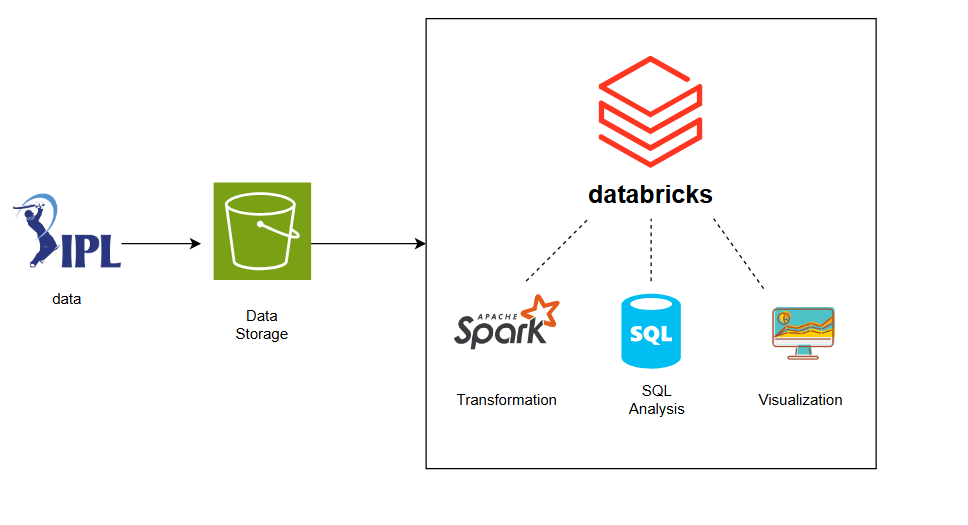
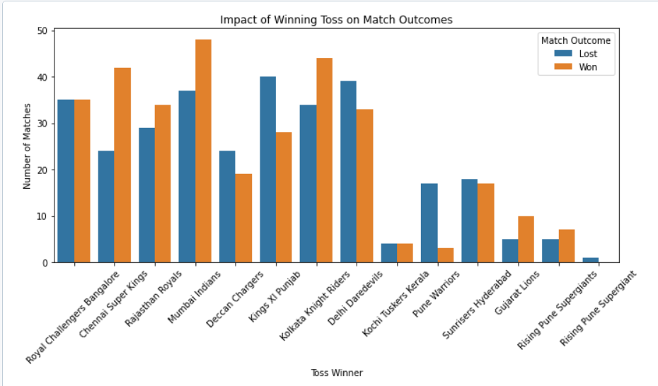
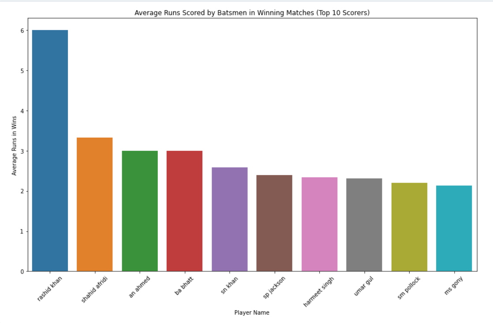
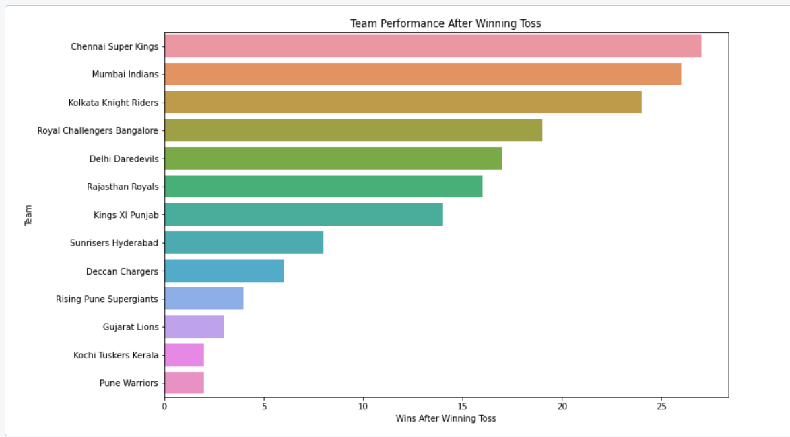

# IPL DataSet Analysis Project

## Overview

In this Data Engineering Project, we have a IPL Dataset from 2017 (Data source) and storing that data into AWS S3 as raw data and perform the necessary Transformation and and do some SQL analysis in Databricks using sparkSQL, then we can do the some Visualization/visaul analysis of the transformed data.

## Prerequisites

Directions or anything needed before running the project.

- Basic Knowledge on SQL and Python/PySpark
- Databricks account
- Storage Repository like AWS S3, github (optional)

## How to Run This Project

Since this Project is compeletly cloud based, we don't need to any Program/Software to install in local system

1. Place the data source in Github repositoy
2. Setup Azure account (Free trial with credits)

### Data Architecture

As per above Architecture, we have data source placed in AWS S3 bucket, from there we ingest data into databricks notebook so that we can get access to data source in order to perfrom transformations. we will do transoformation using python API called PySpark and then using trasnformed data we can use SQL analysis as per some scenarios we can do some Analytics as well to get Visualization representation or to create a dashboard

### Data Visualization

## Lessons Learned

It's good to reflect on what you learned throughout the process of building this project. Here you might discuss what you would have done differently if you had more time/money/data. Did you end up choosing the right tools or would you try something else next time?

## Contact

Please feel free to contact me if you have any questions at: LinkedIn, Twitter
