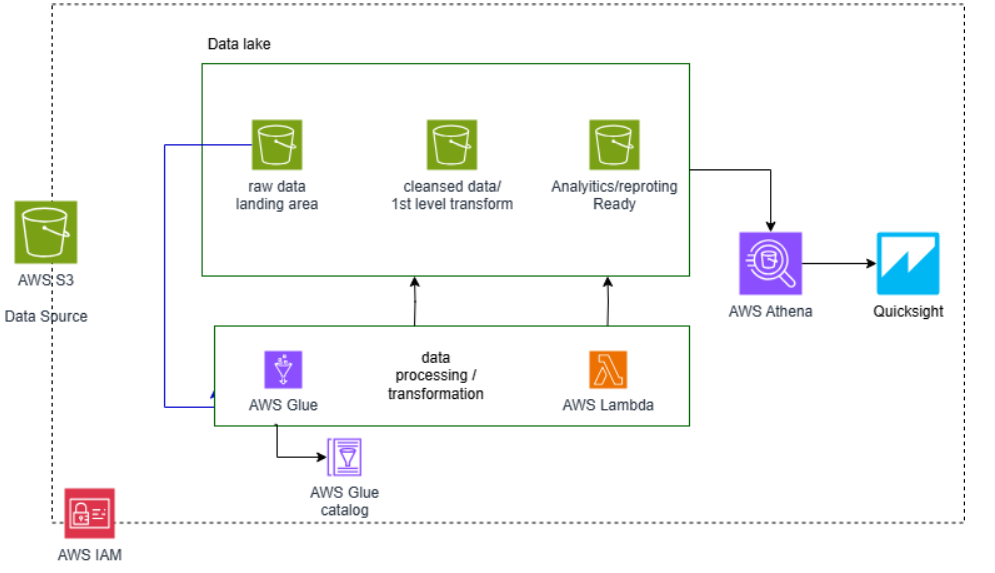
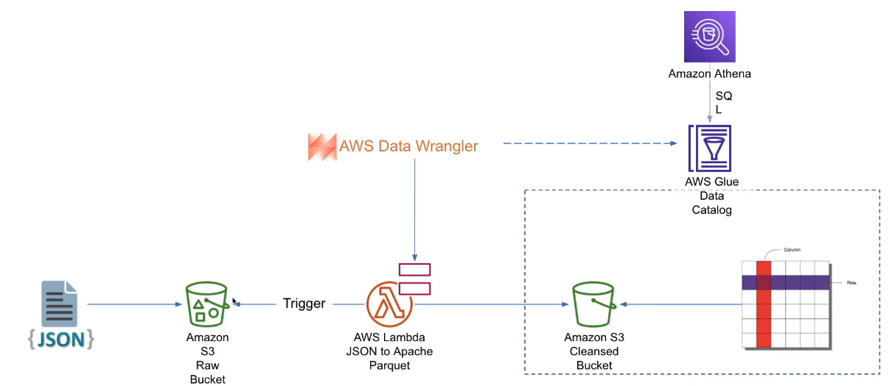
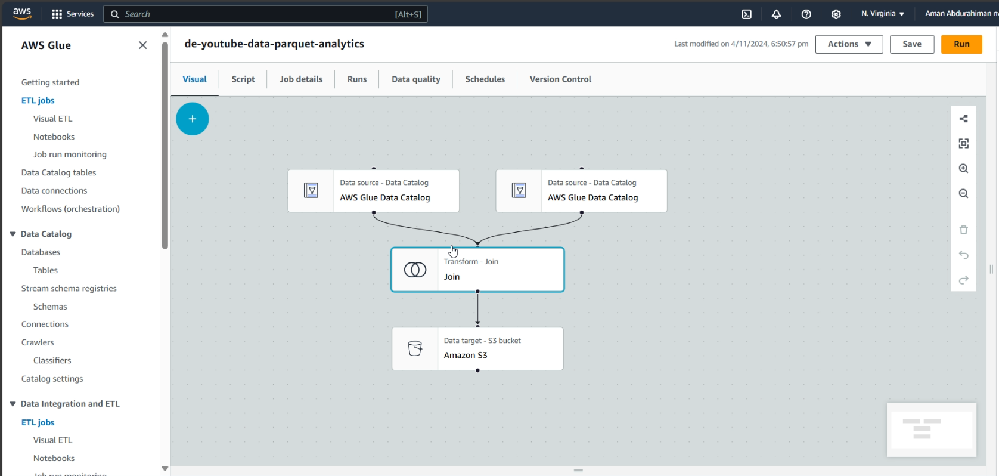
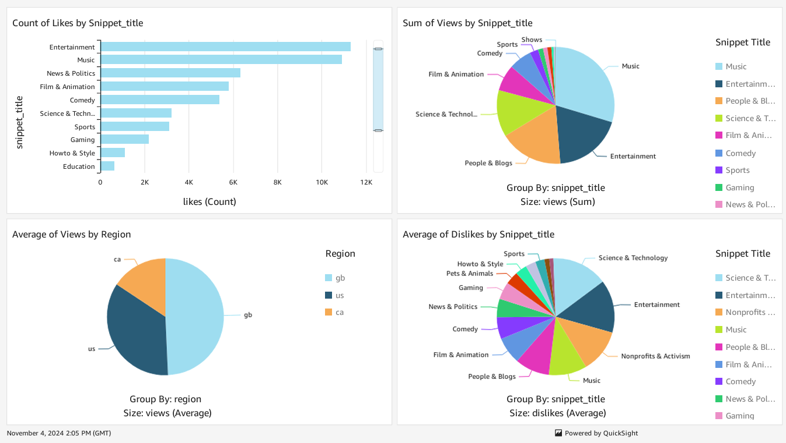

# Youtube Data Engineering and analysis project

## Overview

In this Data Engineering Project, we have a data set of Youtube data for a particular year and storing that into AWS S3 as data source. we are using S3 for storage and transformed data storage with 3 different stages. Finally once the raw data transformed full we will make use Athena to get SQL analytical insights and quickSight to build a dashboard.  

In this Project we can learn about,

- Building data lake from scratch
- understand data lake and data warehouse
- How to user AWS Glue catalog, Glue spark jobs
- make use of Athena and SQL scripting
- Quicksight to build dashboards

## Prerequisites

Directions or anything needed before running the project.

- Basic Knowledge on SQL and Python/PySpark
- AWS Account
- Good to have basic understanding about AWS Services

## How to Run This Project

Since this Project is compeletly cloud based, we don't need to any Program/Software to install in local system

### Architecture and Workflow

As per above Architecture, we have data source placed in AWS S3 bucket, we use AWS Glue for performing ETL tasks, so we have placed raw data (JSON format) in frist S3 bucket inroder to fetch the data or read the data from S3 to AWS Glue, we need ot create crawler which will then create Glue data catalog on top of it resulting to create a database contain the data we placed in S3 into tabular format.

   

We can't directly fetch the data from catalog, since the raw JSON data are in multiline format and nested key/value pair so we need to do some transformation before creating crawler this can be done using AWS lambda. Lambda is serverless compute which we can perform some transformation using programing language it supports(like Python). using Lmbda function, we are transforming/converting the JSON to parquet file format at the same time it will create table/database in AWS Glue. the transformed parquet file is then placed different S3 bucket which is in cleaned/cleansed data. once this is done we will be doing Glue studio to do simple ETL pipleine to join the cleaned table as shown below.

   

Once we perfrom the joining hte cleaned data tables, we then place the result dataset into final S3 bucket as Analytical/reporting version of data. from this we will then create dashboard using AWS Quicksight as shown below section.

### Data Visualization

## Lessons Learned

It's good to reflect on what you learned throughout the process of building this project. Here you might discuss what you would have done differently if you had more time/money/data. Did you end up choosing the right tools or would you try something else next time?

## Contact

Please feel free to contact me if you have any questions at: LinkedIn, Twitter
